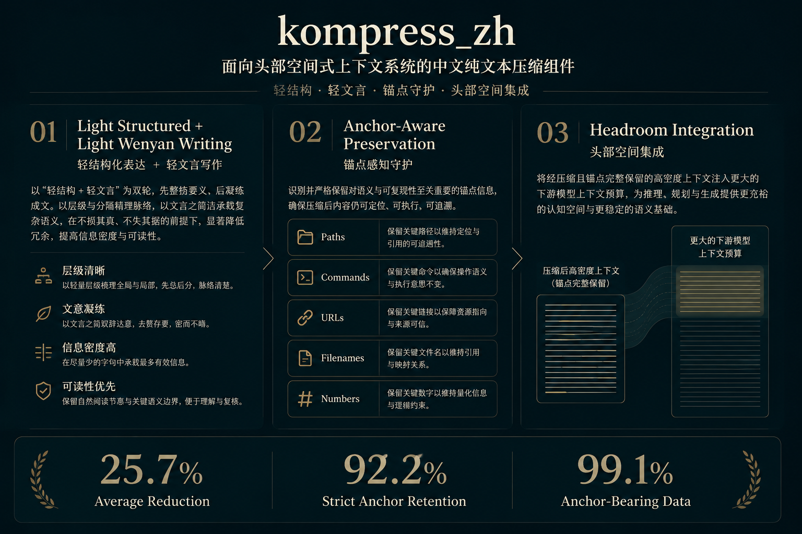

# kompress_zh

[](./docs/KOMPRESS_ZH_BASELINE_V1_DECISION_2026-06-10.md)
[](./docs/CURRENT_MAINLINE_QWEN35_COMPRESSOR.md)
[](./docs/CURRENT_MAINLINE_QWEN35_COMPRESSOR.md)
[](https://huggingface.co/Deserveall/kompress_zh-baseline-v1-lora)
[](./docs/TRAINING_EVAL_STANDARDSET_V6_REFERENCE_V1_2026-06-10.md)
[](./docs/HF_MODEL_CARD_BASELINE_V1_RELEASE.md)

<p align="center">
  
</p>

> A Chinese plain-text compressor for agent-grade context, not a generic summarizer.

> **Qwen3.5-0.8B baseline. 25.7% average reduction on anchor-heavy Chinese agent text. 92.2% strict anchor retention. 99.1% anchor-bearing data.**

> Metrics above refer to the June 10, 2026 baseline-v1 test split (`132` samples).

> Model repo: [Deserveall/kompress_zh-baseline-v1-lora](https://huggingface.co/Deserveall/kompress_zh-baseline-v1-lora)

`kompress_zh` 是一个面向中文 Agent / 文档工作流的压缩改写项目。  
它专门处理中文自然语言长段，把文本压得更短，同时尽量保留语义、路径、命令、文件名、URL、数字条件等关键锚点，并维持一种适合继续喂给强模型阅读的高信息密度风格。

它的目标从来不是“写个摘要”，而是做一个**可嵌入 `headroom_zh` 一类上下文压缩系统的中文 plain-text 组件**。

## Core Claim

`kompress_zh` 的核心主张很简单：

- 它不是通用摘要器，而是**部署导向**的中文 plain-text compressor。
- 它不是随意追求更短，而是追求**更短但不压坏工程上下文**。
- 它不是只看平均压缩率，而是明确把**风格、锚点、可嵌入性**当作一等约束。

如果把目标说得再直接一点：

> 我们要的不是“中文写得更短”，而是“中文 Agent 上下文在被压缩后，仍然能被后续模型高可靠地继续使用”。

## Why This Exists

真实 Agent 工作流里，大量高成本上下文并不是代码，而是：

- 任务说明
- 约束与交付要求
- 进度同步
- 项目文档段落
- 结果解释
- 混有路径、命令、文件名、数字条件的自然语言块

这类文本有三个典型难点：

1. 它们往往比代码更长、更口语、更重复。
2. 它们比普通摘要任务更强调保真，而不是“提炼观点”。
3. 它们内部常带有不能随便动的工程锚点，压缩时一旦压坏，后续链路可用性会立刻下降。

`kompress_zh` 就是为这个空白层定义的。

## Design Highlights

### 1. The Style Is Constrained on Purpose

这个项目不是让 teacher 和学生模型“自由发挥压缩感”，而是从任务定义上就限制输出风格：

- 轻结构化
- 轻文言压缩感
- 现代中文主体
- 高信息密度
- 大模型继续可解析

换句话说，我们刻意避开两种常见失败风格：

- 泛摘要腔：读起来像总结，不像工作文本
- 纯古文腔：看着短，但解析性和可控性下降

我们希望得到的是一种介于现代中文与压缩书写之间的工作风格。这一点不是审美偏好，而是部署可用性要求。

### 2. Anchor Awareness Is Built into the Data

很多压缩模型默认把路径、文件名、命令、URL、参数、数字条件视为“可顺手压掉的噪声”。  
`kompress_zh` 反过来把它们当成真实部署里最需要保护的部分之一。

当前 baseline 数据 `standardset_v6_1234`：

- total samples: `1234`
- anchor rows: `1223 / 1234`，约 `99.1%`
- avg anchor count: `3.96`

这意味着它不是一个“干净纯文字摘要集”，而是主动混入了大量真实工程锚点的压缩数据集。  
这也是它和普通中文压缩数据最不一样的地方之一。

### 3. Evaluation Separates Strict vs Soft Anchors

我们没有把所有锚点混成一个粗糙总分。

当前评测口径明确区分：

- `strict anchors`
  - URL
  - 路径
  - 文件名
  - 命令 / 参数
  - repo / model id
- `soft anchors`
  - 编号
  - 字段名
  - identifier
  - 轻格式 token

这是个很关键的设计。  
真实部署里最严重的问题通常不是“编号轻微变化”，而是“路径、命令、文件名被压坏”。如果这两类东西不分开，评测会很容易给出误导结论。

### 4. Metrics Are Not Treated as Truth

我们专门避免一个很常见但很危险的错误：  
把自动脚本分数直接当成模型质量真值。

这里一直坚持的原则是：

- 脚本负责筛查、排序、抽样
- 低分 case 必须回到原文 / 参考压缩 / 模型输出做人工复核
- `soft anchor` 波动不能直接外推为模型能力显著下降

这让我们的评测更接近“面向部署的质量判断”，而不是只做一个好看的平均分。

### 5. The Task Boundary Is Deliberately Narrow

很多项目一开始说做压缩，最后会逐渐滑成一个模糊的“中文摘要器”。  
`kompress_zh` 从一开始就把边界卡得很清楚：

- 主处理对象：中文 plain-text 长段
- 可混入少量工程锚点
- 不直接处理 raw code / raw logs / raw diffs / raw configs

正因为边界足够窄，它才更像一个能稳定嵌入系统的模块，而不是一个泛化模糊的 demo。

## Method Overview

`kompress_zh` 当前路线可以概括成四步：

1. `source pool`
   - 从真实中文工作文本里抽取可压缩段落，而不是拿泛摘要语料替代。

2. `teacher labeling`
   - 用受约束 prompt 生成“轻结构化 + 轻文言压缩感”的参考压缩文，而不是放任 teacher 自由摘要。

3. `anchor-aware review and eval`
   - 用脚本做大规模筛查，但把 case 级人工复核放在最后裁决位，尤其关注 strict anchors 是否真的丢失。

4. `downstream integration`
   - 目标不是停在离线分数，而是让压缩后的中文上下文能继续进入 `headroom_zh` 一类系统的后续推理链路。

这四步合在一起，定义的是一个**可部署的中文 plain-text compression workflow**，而不只是“训了个压缩模型”。

## A Compression Style That Actually Matters

下面这个例子不是在展示“能不能写短”，而是在展示 `kompress_zh` 追求的风格目标。

原文：

```text
复制下面模板，直接接在文末：

- “本次工作”写动作，不写空话
例：`补跑 s800 全量 baseline vs finetuned 评测`

- “修改/涉及文件”必须给相对路径
例：`scripts/eval_compare_full.py`、`docs/PROJECT_PROGRESS.md`

- “建议下一步”要让下一个同学可以直接开做
```

目标风格：

```text
模板接文末：
- “本次工作”写动作，勿空话：补跑 s800 全量 baseline vs finetuned 评测
- “修改/涉及文件”须给相对路径：scripts/eval_compare_full.py、docs/PROJECT_PROGRESS.md
- “建议下一步”须让下一位可直接开做
```

这里真正重要的不是“字符更少”本身，而是：

- 结构被压紧了
- 表达带轻文言压缩感
- 路径和文件名仍然保留
- 后续模型继续读时，约束没有被压坏

## Representative Test-Set Cases

下面不是手写 demo，而是来自当前 baseline 测试集的真实 case。

### Example A: Execution Consensus Compression

原文：

```text
## 4. 当前最重要的执行共识

后续推进时请默认遵守以下共识：

1. 当前任务不是数学 `think` 监督，而是中文长文本压缩改写。
2. 当前输出不是 `<think>`，而是 assistant 的可见压缩文本。
3. 当前主基座仍是 `Qwen/Qwen3.5-0.8B`。
4. 当前训练方式仍是 `Swift + LoRA`。
5. 当前必须使用 `language-model-only`，避免把 vision encoder 带进来。
6. 当前模型只处理 Headroom 路由出来的中文 plain-text 长段。
```

模型输出：

```text
后续推进默认遵守共识：任务为中文长文本压缩改写，非数学think监督；输出为assistant可见压缩文本，非<think>；主基座Qwen/Qwen3.5-0.8B；训练方式Swift+LoRA；须用language-model-only，勿带vision encoder；仅处理Headroom路由出的中文plain-text长段。
```

这个例子体现的是：

- 任务边界被大幅压紧，但核心约束未丢
- `Qwen/Qwen3.5-0.8B`、`language-model-only`、`plain-text` 等关键锚点仍在
- 输出继续像工作约束，而不是变成泛摘要

### Example B: Benchmark / Ops Rule Compression

原文：

```text
当前统一基线评测入口是 `scripts/eval_compare_full.py`。

未经统一确认，不要私自修改以下核心口径：

- `max_tokens`
- 答案抽取规则
- baseline / finetuned 对照方式
- `DeepSeek` 复核模式
```

模型输出：

```text
Benchmark 口径不得私自改：统一基线入口 scripts/eval_compare_full.py，勿改 max_tokens、答案抽取规则、baseline/finetuned 对照方式、DeepSeek 复核模式。
```

这个例子体现的是：

- benchmark / ops 规则可被压成高密度工作文本
- 路径、参数名、对照方式、工具名仍然保留
- 输出不是摘要，而是保真压缩改写

### Example C: Step-by-Step Test Instruction Compression

原文：

```text
# 单词卡点击功能测试指南

## 方法1: 使用测试页面

1. 打开浏览器访问: `http://localhost:8080/test-popup-click.html`
2. 点击页面上的"运行自动化测试"按钮
3. 查看测试结果

## 方法2: 在浏览器控制台运行测试脚本

1. 打开你的应用页面（Reader 组件页面）
2. 打开浏览器开发者工具（F12）
3. 在 Console 标签中，粘贴以下代码并运行：

## 方法3: 手动测试步骤

1. **测试基本功能**
- 点击第一个高亮单词 → 应该显示该单词的单词卡
- 点击第二个高亮单词 → 应该关闭第一个单词卡，显示第二个单词卡
- 点击第三个高亮单词 → 应该关闭第二个单词卡，显示第三个单词卡
```

模型输出：

```text
方法1：访问http://localhost:8080/test-popup-click.html，点击“运行自动化测试”按钮，查看结果。
方法2：打开应用页面（Reader组件），打开开发者工具（F12），在Console标签粘贴测试脚本并运行。
方法3：手动测试：点击第一个高亮单词→显示单词卡；点击第二个高亮单词→关闭第一个，显示第二个；点击第三个高亮单词→关闭第二个，显示第三个。
```

这个例子体现的是：

- 操作步骤可以被压成更短的执行文本
- `http://localhost:8080/test-popup-click.html` 与 `F12` 这类执行锚点保留
- 多步骤说明没有被压成模糊总结

### Example D: One Real Boundary Case

原文：

```text
- [CHINESE_KOMPRESS_ROUTE_COMPARISON.md](./CHINESE_KOMPRESS_ROUTE_COMPARISON.md)
- 这是路线比较文档，不是最终执行稿。

- [WHY_NO_CHINESE_KOMPRESS_YET.md](./WHY_NO_CHINESE_KOMPRESS_YET.md)
- [CHINESE_KOMPRESS_LANDSCAPE_SURVEY.md](./CHINESE_KOMPRESS_LANDSCAPE_SURVEY.md)
- [CODING_AGENT_DATASET_SURVEY.md](./CODING_AGENT_DATASET_SURVEY.md)
- 这些是背景调研材料。
```

模型输出：

```text
[CHINESE_KOMPRESS_ROUTE_COMPARISON.md](./CHINESE_KOMPRESS_ROUTE_COMPARISON.md) 为路线比较文档，非最终执行稿。[WHY_NO_CHINESE_KOMPRESS_YET.md](./WHY_NO_CHINESE_KOMPRESS_YET.md)、[CHINESE_KOMPRESS_LANDSCAPE_SURVEY.md](./CHINESE_KOMPRESS_LANDSCAPE_SURVEY.md)、[CODING_AGENT_DATASET_SURVEY.md](./CODING_AGENT_DATASET_SURVEY.md) 为背景调研材料。
```

这个例子体现的不是优点，而是当前 baseline 的真实边界：

- 锚点保住了
- 但 markdown link 壳子留得太多
- 说明这版仍偏保守，尤其在“本可更激进压缩”的样本上

成熟项目不该只展示好看的例子，也该把当前 failure mode 讲清楚。

## Baseline Snapshot

当前 baseline 已完成：

- base model: `Qwen/Qwen3.5-0.8B`
- method: `Swift + LoRA`
- mode: `language-model-only`
- dataset: `standardset_v6_1234`
- checkpoint: `reference_v1 / checkpoint-61`

核心结果：

| Item | Value |
| --- | --- |
| Train / Val / Test | `973 / 129 / 132` |
| Avg teacher compression ratio | `0.6563` |
| Avg prediction ratio | `0.7425` |
| Avg char F1 | `0.8039` |
| Avg strict anchor retention | `0.9216` |
| Avg soft anchor retention | `0.8075` |
| Final train loss | `0.5575` |
| Final eval loss | `0.5315` |
| Final eval token acc | `0.8566` |

说明：
- 上述离线结果对应 `2026-06-10` 的 baseline-v1 评测。
- 测试集规模为 `132`，train / val / test 划分为 `973 / 129 / 132`。

当前这版模型的定位很明确：

- 它已经是一个**成立的 baseline**
- 它在保真与 strict anchor 保留上已经可用
- 它仍然偏保守，不是最终效果版
- 它已经足够支撑后续 `headroom_zh` 的第一轮真实集成验证

如果只看压缩率，你会低估这个项目的价值。  
更值得看的其实是：

- 风格已经稳定落在“轻结构化 + 轻文言压缩感”
- 数据与评测都围绕真实 Agent 文本而不是普通摘要文本定义
- `strict anchor` 保留已经达到 `0.9216`
- 项目已经具备组件级可用性的雏形

## Why This Matters for headroom_zh

`headroom_zh` 真正需要的，不是一个“能把话写短”的模型，而是一个：

- 能压缩中文长段
- 仍保留关键执行锚点
- 输出继续适合强模型往下读
- 不把工程上下文压坏的组件

`kompress_zh` 当前这些设计选择，正是在为这个目标服务：

- 轻结构化让信息更快被后续模型解析
- 轻文言压缩感提高单位长度信息密度
- anchor-heavy 数据分布让模型习惯在压缩时保护关键字面内容
- strict / soft 分层评测让我们真正知道“有没有把关键东西压坏”

这也是它和普通中文压缩模型最实用的差异。

## Use Cases

当前最适合 `kompress_zh` 的输入类型：

- 中文任务说明与执行要求
- 中文规范、流程、交付说明
- 中文进度同步与结果解释
- 中文项目文档中的长自然语言段落
- 混有少量路径、命令、文件名、数字条件的工作文本

当前不适合直接让它处理的内容：

- raw code
- raw JSON / YAML / XML
- logs / stack traces
- diff / patch
- 需要自由发挥的摘要或创作式改写

最合适的系统位置是：

- 先由上游路由识别“中文 plain-text 长段”
- 再交给 `kompress_zh`
- 其余结构化内容继续走专门压缩链路

这就是它和 `headroom_zh` 的天然契合点。

## Quick Facts

| Label | Value |
| --- | --- |
| Project Type | Chinese plain-text compression |
| Deployment Goal | `headroom_zh`-style context compression |
| Output Style | light structure + light wenyan |
| Data Character | anchor-heavy |
| Eval Philosophy | strict/soft split + case audit |
| Current Stage | baseline v1 |

## Repository Map

```text
data/
  raw/         source docs, labeled pairs, review decisions
  interim/     review queues, source pools, audit packs
  final/       train/val/test exports for official runs

scripts/
  build_dataset.py
  validate_dataset.py
  label_with_deepseek.py
  train_lora.py
  eval.py

src/
  zh_plaintext_compressor/common/

experiments/
  remote_sync/
  logs/

docs/
  mainline, status, training notes, release-facing docs
```

## Read This First

1. [docs/CURRENT_MAINLINE_QWEN35_COMPRESSOR.md](./docs/CURRENT_MAINLINE_QWEN35_COMPRESSOR.md)
2. [docs/KOMPRESS_ZH_BASELINE_V1_DECISION_2026-06-10.md](./docs/KOMPRESS_ZH_BASELINE_V1_DECISION_2026-06-10.md)
3. [docs/TRAINING_EVAL_STANDARDSET_V6_REFERENCE_V1_2026-06-10.md](./docs/TRAINING_EVAL_STANDARDSET_V6_REFERENCE_V1_2026-06-10.md)
4. [docs/HF_MODEL_CARD_BASELINE_V1_RELEASE.md](./docs/HF_MODEL_CARD_BASELINE_V1_RELEASE.md)
5. [Deserveall/kompress_zh-baseline-v1-lora](https://huggingface.co/Deserveall/kompress_zh-baseline-v1-lora)
6. [docs/README.md](./docs/README.md)

## Quick Start

```bash
python scripts/build_dataset.py training --input-file data/raw/labeled_pairs_demo_v1.jsonl --dataset-tag demo_rewrite_v1
python scripts/validate_dataset.py data/final/train_demo_rewrite_v1.jsonl --mode training --require-shorter
python scripts/train_lora.py --dataset-tag standardset_v6_1234 --run-tag reference_v1 --language-model-only
python scripts/eval.py --dataset-tag standardset_v6_1234 --checkpoint <checkpoint_dir> --run-tag test_eval --language-model-only
```

## Current Limitations

当前 baseline 仍有明确限制：

- 压缩激进度偏保守
- 对本可大幅压缩的样本，经常只做到“稳妥改写”
- 尚未完成大规模真实线上接入验证
- 尚未发布正式 Hugging Face 模型卡与 inference repo

## Failure Modes We Explicitly Track

我们当前最关注的 failure modes 不是抽象的“效果不好”，而是这些部署里真的会出问题的类型：

1. 该压得更狠时仍然偏保守
   - 常见于 link-heavy 文本、说明性段落、可明显重组的材料。

2. soft anchors 波动引发误判
   - 例如编号、轻格式 token 变化，会让粗糙脚本误报，但未必真影响可用性。

3. 少数样本会压掉“下一步 / 风险 / 交付”类提示
   - 这类 case 需要人工抽查，而不能只看均值。

4. 极高密度 checklist / 规范文本本来就难压
   - 这类样本若被误判成“模型太差”，会把训练方向带偏。

我们把这些 failure modes 明说出来，是因为这个项目本来就不是“只要指标好看就行”的路线。

但它已经证明了三件很重要的事：

- 中文 Agent plain-text 压缩器这条路线是可做的
- 轻结构化 + 轻文言 + anchor-aware 的任务定义可以训成稳定 baseline
- 这套东西确实有望成为 `headroom_zh` 的高价值上游组件

## Roadmap

短期：

- 继续打磨 Hugging Face 首版发布材料
- 为 `headroom_zh` 准备最小集成验证链路
- 固化 baseline 对外叙事与示例

中期：

- 以当前 `1k+` 标准集为样板扩到更完整的数据规模
- 训练第二版更强模型
- 建立更系统的 case benchmark 与接入评测

## Documentation

- [docs/README.md](./docs/README.md)
- [docs/CURRENT_MAINLINE_QWEN35_COMPRESSOR.md](./docs/CURRENT_MAINLINE_QWEN35_COMPRESSOR.md)
- [docs/PROJECT_STATUS_2026-06-09.md](./docs/PROJECT_STATUS_2026-06-09.md)
- [docs/TRAINING_EVAL_STANDARDSET_V6_REFERENCE_V1_2026-06-10.md](./docs/TRAINING_EVAL_STANDARDSET_V6_REFERENCE_V1_2026-06-10.md)
- [docs/KOMPRESS_ZH_BASELINE_V1_DECISION_2026-06-10.md](./docs/KOMPRESS_ZH_BASELINE_V1_DECISION_2026-06-10.md)

## Status

`kompress_zh` 当前已经完成第一版 baseline 收口。  
下一阶段重点不是继续死抠这版，而是把它做成一个看起来成熟、叙事锋利、可被真实系统复用和推广的社区项目起点。
